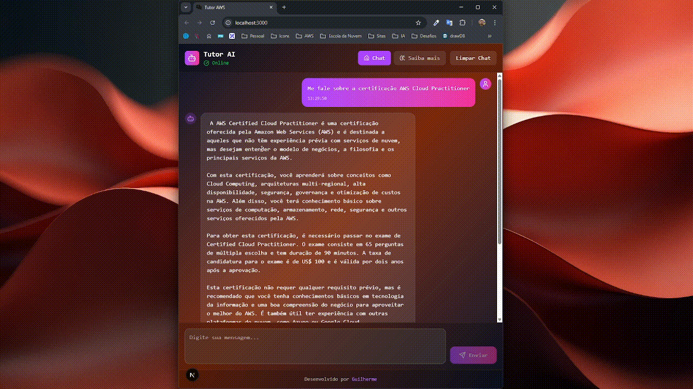

<div align="center">
  
</div>

# Visão Geral

Este é um projeto de um aplicativo de chat interativo que permite aos usuários conversar com um "Tutor" alimentado por um modelo de linguagem grande (LLM) rodando por container via Ollama. O projeto é dividido em duas partes principais: um backend em Python (FastAPI) que serve como uma API para interagir com o Ollama, e um frontend em Next.js (React/TypeScript) que fornece a interface de usuário.

## Tecnologias Utilizadas

Este projeto utiliza uma pilha de tecnologias moderna e eficiente:

### Backend
* **Python:** Linguagem de programação principal.
* **FastAPI:** Um framework web de alta performance para construir APIs assíncronas em Python.
* **Httpx:** Cliente HTTP assíncrono utilizado para fazer requisições ao serviço Ollama.
* **Pydantic:** Biblioteca para validação de dados e configurações, garantindo a integridade dos payloads da API.
* **Uvicorn (Implícito):** Servidor ASGI que executa a aplicação FastAPI.
* **Ollama:** Um framework para rodar e gerenciar modelos de linguagem grandes (LLMs) localmente.
* **Mistral:instruct:** O modelo de linguagem específico utilizado via Ollama para as interações do chat.

### Frontend
* **TypeScript:** Superset do JavaScript que adiciona tipagem estática, melhorando a robustez e manutenibilidade do código.
* **React:** Biblioteca JavaScript para construção de interfaces de usuário dinâmicas e reativas.
* **Next.js:** Framework React que oferece recursos como Server-Side Rendering (SSR), Static Site Generation (SSG) e um sistema de roteamento intuitivo, além da diretiva `use client` para componentes interativos.
* **Lucide React:** Uma biblioteca de ícones leves e personalizáveis, usados para enriquecer a interface do usuário.
* **Tailwind CSS (Implícito):** Framework CSS utility-first para estilização rápida e responsiva dos componentes da UI.

### Orquestração
* **Docker & Docker Compose:** Utilizados para empacotar, orquestrar e isolar os serviços do backend (FastAPI) e do LLM (Ollama), garantindo um ambiente de desenvolvimento e produção consistente e fácil de configurar.

### Demonstração

<div align="center">
  
</div>

## Funcionalidades

* **Chat Interativo:** Permite aos usuários enviar perguntas e receber respostas do Tutor AI.
* **Status da API:** Exibe o status de conexão com a API do backend (online/offline/verificando).
* **Indicação de Carregamento:** Mostra um indicador visual enquanto o Tutor AI está processando a resposta.
* **Limpar Chat:** Opção para resetar a conversa.
* **Mensagens de Erro:** Trata e exibe mensagens de erro amigáveis em caso de falha na comunicação com a API ou Ollama.

## Como Configurar e Executar o Projeto

Siga os passos abaixo para colocar o projeto em funcionamento na sua máquina local.

### Pré-requisitos

* [Docker](https://www.docker.com/get-started/) (com Docker Compose incluído)
* [Node.js](https://nodejs.org/en/download/) (com npm ou yarn) para o frontend

### 1. Clonar o Repositório

```bash
git clone https://github.com/guilhermexL/tutor-aws.git
cd tutor-aws
```

### 2\. Configuração do Backend e Ollama (Docker Compose)

Vá no terminal na pasta raiz do projeto onde está o arquivo `docker-compose.yml` pronto, construa e inicie os serviços:

```bash
docker-compose up --build -d
```

  * `--build`: Garante que as imagens dos seus serviços sejam construídas (ou reconstruídas) se houver mudanças no Dockerfile.
  * `-d`: Executa os contêineres em segundo plano (detached mode).

Você pode verificar o status dos serviços com:

```bash
docker-compose ps
```

### 3\. Configuração e Execução do Frontend (Next.js)

Assumindo que seus arquivos do frontend (como `page.tsx`) estão na raiz do seu projeto Next.js:

```bash
# Navegue para a pasta raiz do seu projeto frontend (se for separada)
# cd frontend-app 

# Instale as dependências
npm install # ou yarn install

# Execute o servidor de desenvolvimento
npm run dev # ou yarn dev
```

O frontend estará acessível em `http://localhost:3000`.

### 4. Defesa de Projeto

Veja nossa documentaçao de defesa do tutor inteligente [aqui](./resources/pitch-final/Relatório%20Final%20-%20Projeto%20EdN.pdf)

## Licença

Este projeto está licenciado sob a licença MIT. Veja o arquivo [`LICENSE`](./assets/LICENSE) para mais detalhes.